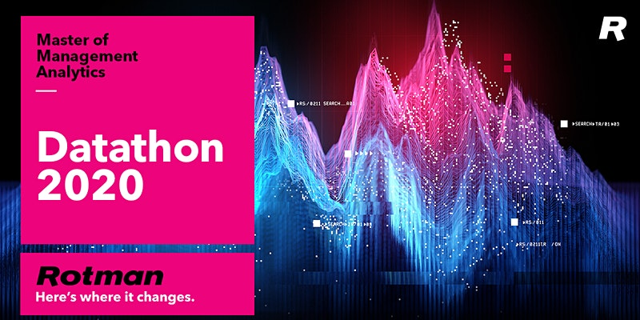

## Competition:
[2020 University of Toronto Master of Management Science Data Hackthon](https://www.rotman.utoronto.ca/Degrees/MastersPrograms/MMA/datathon2020/Datathon2020FAQ) 

## Challenge: 
Medical Insurance Fraud Investigation
-  `Team name`: Team Hortons
- `Team members`: [Minke Wang](https://github.com/chelseawmk?tab=stars), [Yuqing Sun](https://git.uwaterloo.ca/yasun), [Lily(Lan Xiazi) Liu](https://www.linkedin.com/in/lanxiaziliu/), [Junduo Dong](https://github.com/Junduo123)

## Background
- Medical provider fraud is one of the biggest problems facing the US public healthcare system. Medicare, one of the largest public insurance programs primarily for people aged 65 or older,accounts for a majority of public healthcare spending and has been the target of many fraud schemes.
- Extensive records are collected by Medicare on its utilization and costs; however, it
is still vulnerable to fraud with fewer than 5% of Medicare claims being audited

## Problem
- Analysis of Medicare data has shown that many cases of fraud involved physicians and associated providers. They adopt ways in which an ambiguous diagnosis code is used to charge Medicare for unnecessary procedures and drugs. This results in increased costs, raising insurance premiums for all Americans.
- Accurate identification of providers who should be targeted with an audit is of utmost importance to Medicare.
- Analyze the data (using the tools of your choice) and make a recommendation on the criteria that should be used to select which medical providers are audited

**Presentation Slides:** This is our presentation slides outlining our analytical roadmap, findings, recommendations, along with appendix: [Presentation Slides](https://docs.google.com/presentation/d/1RopED3CJdBxJSxvYBHGgDMfeHC8DBE5cvPtHx__Hqd0/edit#slide=id.ga453bbeaa7_0_43)

**Useful Code:** We use R language as our analytical tool to conduct statistical test for this challenge: [Code.Rmd](https://github.com/Junduo123/Medical-Insurance-Fraud-Investigation./blob/main/Medical%20Insurance%20Fraud%20Investigation%20-%20Team%20Hortons.Rmd)

**Tableau Dashboard:** We use Tableau as our storytelling tool to make interactive dashboard and infographics for this challenge: [Tableau Public](https://public.tableau.com/profile/junduo#!/vizhome/MedicalInsuranceFraudInvestigation/WelcomePage)
